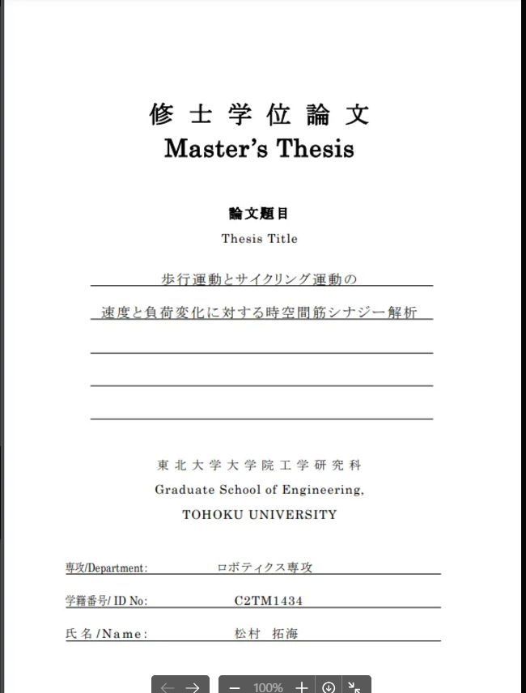
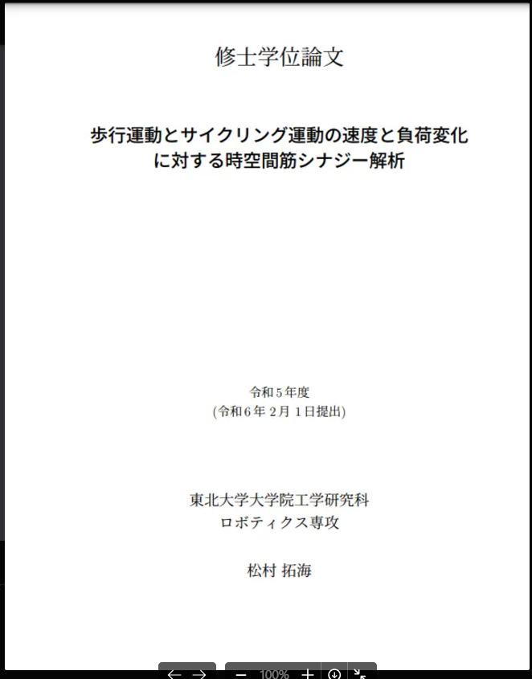
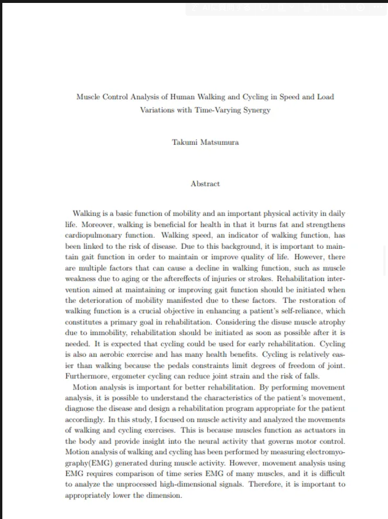
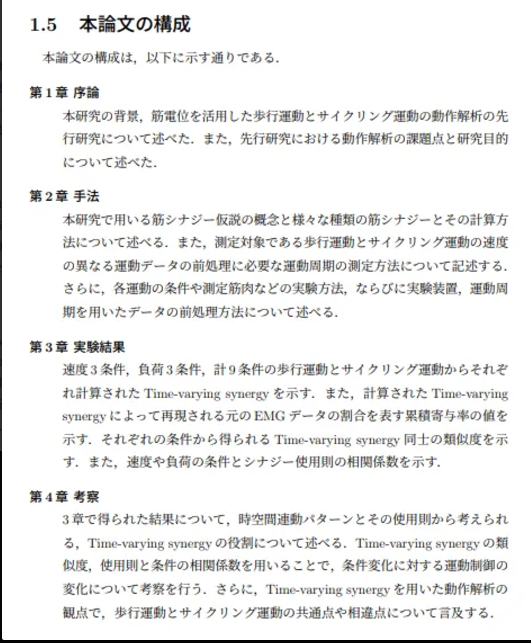
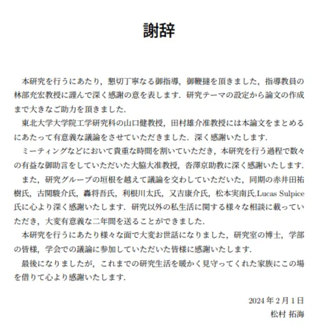
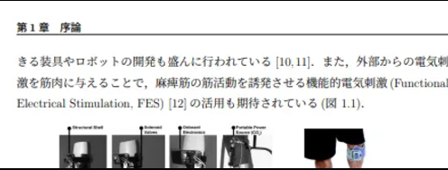

# MasterThesisTemplate  
本体はpushしてないので, 中身は自分の環境でcompileして確認して.  

## compile
latexmkコマンドを入れるだけ  
~~~bash
latexmk main
~~~

## 現状問題
※解決したのは取り消し線  
- ~~余白設定~~  
  今のままだと、なんかtopが詰まる
- ~~目次のページ番号をローマにしたい~~  
- ~~英語が改行しない~~  
  →テスト用の単語が長すぎただけ 

## フォーマットについて
### 構成
- 表紙  
  →pdfで作ってmain.texで挿入する  
  
- 白紙1枚
- タイトルとか  
  
- 英語のアブスト  
  
- 白紙1枚
- 目次
- 図目次
- 表目次
- コンテンツ (奇数ページ始まり)
  1. 序論
    - 研究背景
    - 先行研究
    - 先行研究の課題
    - 研究の目的
    - 論文の構成  
      
  2. 手法
  3. 結果
  4. 考察
  5. 結論
- 謝辞  
  
- 参考文献

### その他
- 章はじめは奇数ページ  
  =cleardoublepageをやる  
- コンテンツタイトル以外は、上にヘッダをつける
  - 偶数ページ → 左  
  - 奇数ページ → 右  
      
      
- 英語アブストの次の白紙ページまでは、ページ番号をつけない
- 目次～表目次まではページ番号はローマ字
  - ⅠとかⅤとか
- 序論～参考文献(=最後)まで普通の数字
  - 1とか5とか